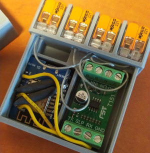
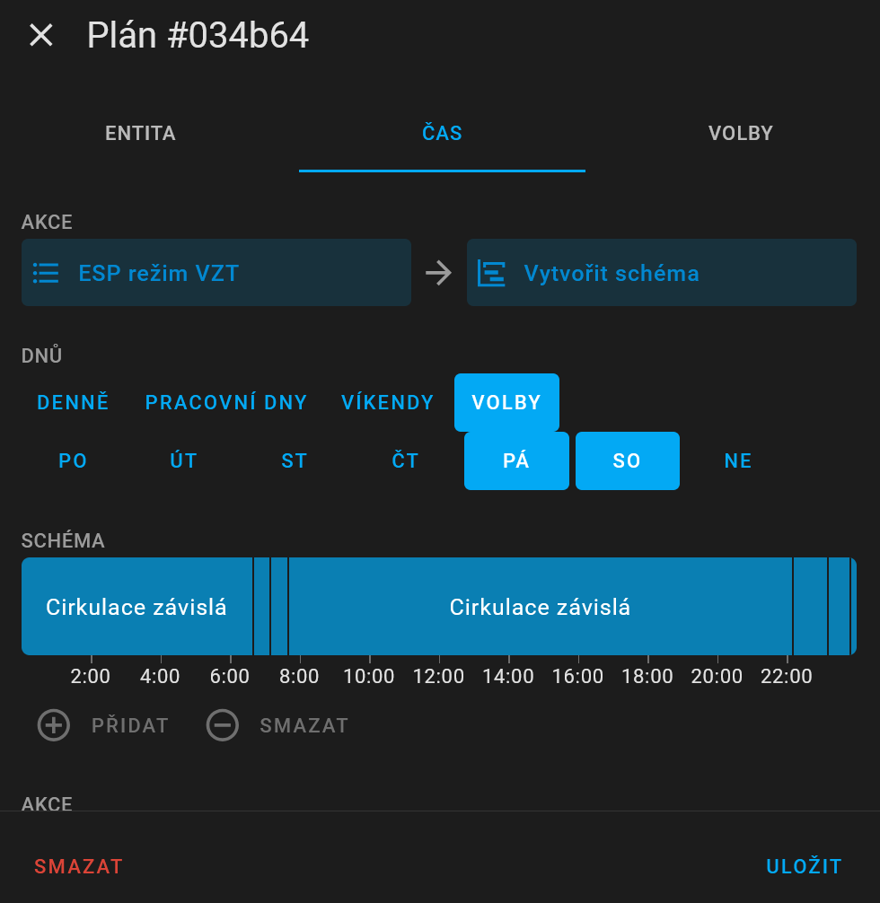

# ESP Atrea #
Replacement of the CP 07 RD controller with the ESP8266 module for controlling the Atrea RB / RC / RK2 / RDH air handling units and similar using Home Assistant. The module can either monitor or directly replace the CP07 controller via ESP8266, LIN bus interface and a Home Assistant. The module allows control of ventilation, heating and cooling.


# Hardware
The CP07 controller communicates with the ATREA RK2 heat recovery unit via the LIN bus. It communicates at 300 Bauds and each packet has 10 bytes. The CP07 controller sends a query to the Atrea unit (the type is in bytes 2 and 3) and receives a response from Atrea.

For the connection use a LIN bus interface [TTL UART to LIN Can Bus Converter](https://www.aliexpress.com/item/1005006301070554.html) or maybe [UART to LIN Bus Module](https://www.aliexpress.com/item/1005008689817215.html), an ESP8266 module WeMos D1 mini and [DC Power Shield V1.1.0 for WEMOS D1 mini](https://www.aliexpress.com/item/1005001621800502.html).
The ESPAtrea module can completely replace the CP07 controller, but I recommend only inserting the module into the wiring and disconnecting the LINBUS wire to the CP07 controller with a switch due to the possibility of setting parameters. If the CP07 controller is connected and communicating, the ESPAtrea module detects this and only monitors the communication. The CP07 driver is still required to configure the unit, but can be disconnect after setup ATREA.

The complete module can be installed in a [printed box](espatrea.stl) with WAGO terminals. There is also space for installing a LINBUS switch for CP07.




# Logs CP07 (fw 54.07) <-> Atrea (PIC fw 53.59 for Heating pump)
[Logs for individual modes](log.md)


# Decode packets
### The requests packet from the CP07 controller to the Atrea unit:
- 0xF5 [id1 0,1,2] [id2 1,3] [intensity 1,2,4] [mode 1,2,4,8,16] [bps 1,2] [md 1,2] [temp 0,1,2,3] 0x00 [crc]
  - id1 and id2: 0 1, 0 3, 1 3, 2 3
  - intensity is 1=off, 2=medium or 4=max
  - modes:
    - pressure ventilation (PV): mode = 1, bps = 2, md = 1, temp = 0
    - circulation (C): mode = 4, bps = 2, md = 1, temp = 0,2,3
    - dependent circulation (CZ): mode = 4, bps = 2, md = 2, temp = 0,2,3
    - circulation ventilation (CV): mode = 8, bps = 1,2, md = 1, temp = 0,2,3
    - equal pressure ventilation (RV): mode = 16, bps = 1,2, md = 1, temp = 0,2,3
    - cooling: mode = 1, bps = 2, md = 2, temp = 0,1
  - bps: bypass flap for RV and CV (1 bypass, 2 recuperator), in other modes is 2 
  - temp: bit 0x01 = heating / cooling, bit 0x02 = heating season (for new fw CP07?)

- 0xF5 [id1 0x41,0x42,0x43] [id2 0x01] [circulation flap DA1] [node DA2] [MC] [MV] [bits] 0x00 [crc]
  - simul. voltage intake circulation flap DA1: 0-255=0V-10V (adding fresh air 0-0%, 255-100%)
  - simul. voltage node DA2: 0-255=0V-10V
  - engine MC: 0,1,2,3
  - engine MV: 0,1,2
  - bits: 1=bypass SB, 2=ground cooler/intake flap SR (for input E1), 4=pump YV (heat pump heating), 8=electric/gas boiler K, 16=output OC1 (heat pump cooling), 32=output EXT

### The responds packet with the same id1 and id2 from the Atrea unit to the CP07 controller:
- 0xF5 [id1 0x00] [id2 0x01] [mode2 0,1,2,4,5,8,16] [flags: intensity 0,1,2, errorB 0x04, heating 0x08, shock vent. 0x10, fx 0x20] [errors] [TE] [TA] x [crc]
  - modes:
    - nothing: mode2 = 0, flags = 0 or 0x20
    - pressure ventilation: mode2 = 1, flags = 1 or 2
    - circulation: mode2 = 4, flag = 1 or 2
    - dependent circulation standby: mode2 = 4, flags = 0x20
    - dependent circulation ventilation: mode2 = 8, flags = 0x21 or 0x22
    - circulation ventilation: mode2 = 8, flag = 1 or 2xxx
    - equal pressure ventilation: mode2 = 16, flag = 0x21 or 0x22 (electric/gas boiler heating)
    - cooling: mode2 = 5, flags = 0x21 or 0x22
    - heating: mode2 = 4 (circulation dep. and circulation), 8 (circulation vent.), 16 (equal press. vent.), flags = 1 or 2 + 0x08 + fx
  - intensity: 0=off, 1=medium or 2=max
  - shock ventilation flag 0x10 (0x31 or 0x32 with intensity 1 or 2)
  - fx: RV 0 or 0x20 (keeps the previous state), CV 0 or 0x20 (keeps the previous state), CZ 0x20, C 0, PV 0, Cooling 0x20
  - errorB: 0x04 = filter clogged
  - errors: 1=TE error, 2=TI2 error, 4=recuperator freezing, 8=TA error, 16=1st.freezing protection (TI2 < 12°C), 32=2nd.freezing protection (TI2 < 7°C), 64=active STOP, 128=communication error
  - outdoor temperature = TE-50
  - radiator temperature = TA-50

- 0xF5 [id1 0x00] [id2 0x03] [0x60 + power inputs D1-D4 1,2,4,8] [mode] [i1 0x00] [i2 0x00] [i3 0x00] [bits] [crc]
  - power inputs: D1-D3 WC and bathroom 1,2,4, D4 kitchen 8, D11 ?
  - mode: 0=off, 2=PV medium or C medium, 3=PV max or C max, 5=RV medium, 10=RV max or shock ventilation, 6=CV medium, 7=CV max
  - i1-i3: I thing voltage in1-in3 0-255=0V-10V
  - bits: 1=ground cooler/intake flap SR (for input E1), 2=bypass SB, 4=pump YV (heat pump heating), 8=electric/gas boiler K, 32=output OC1 (heat pump cooling)
 
- 0xF5 [id1 0x01] [id2 0x03] [circulation flap DA1] [TA] [TI2] [TE] 0x00 0x99 [crc]
  - intake circulation flap DA1 0-255=0V-10V (adding fresh air 0-0%, 255-100%)
  - radiator temperature = TA-50
  - behind recuperator temperature = TI2-50
  - outdoor temperature = TE-50

- 0xF5 [id1 0x02] [id2 0x03] 0xFF 0x33 0x82 0xEC 0xFF 0xCB [crc]
  
- 0xF5 [id1 0x41] [id2 0x01] [TA] [TI2] [TE] 0x00 0x00 0x00 [crc]
  - radiator temperature = TA
  - behind recuperator temperature = TI2
  - outdoor temperature = TE
      
- 0xF5 [id1 0x42] [id2 0x01] 0xFF 0x33 0x82 0xEC 0xFF 0x0B [crc]
  
- 0xF5 [id1 0x43] [id2 0x01] 0x03 [D1..4] 0x00 0x00 0x00 0x00 [crc]
  - D1..4: D1-D3 WC and bathroom 2,4,8, D4 kitchen 16

### Byte bps control with CP07 controller
The Bps byte control the bypass flap - 1 for bypass and 2 for recuperator. In RV and CV mode, the CP07 controller sets the byte bps according to the outdoor TE temperature, room temperature, and target setpoint temperature. In other modes, the byte bps is set to 2.
#### Rules:
- for a heating season and active heating the CP07 controller sets bps to 2 
- for the heating season, not heating and RV mode
  - 1 = the outdoor TE temperature is greater or equal than 18°C and both the outdoor TE temperature and the requested indoor temperature are less than the actual room temperature
  - 2 = the outdoor TE temperature is less than 17°C or the outdoor TE temperature is greater than the actual room temperature or the requested indoor temperature is greater than the actual room temperature
- for the heating season, not heating and CV mode
  - 1 = the outdoor TE temperature is greater or equal than 16°C and both the outdoor TE temperature and the requested indoor temperature are less than the actual room temperature
  - 2 = the outdoor TE temperature is less than 15°C or the outdoor TE temperature is greater than the actual room temperature or the requested indoor temperature is greater than the actual room temperature
- for the non-heating season and RV mode
  - 1 = the outdoor TE temperature is greater or equal than 16°C and both the outdoor TE temperature and the requested indoor temperature are less than the actual room temperature
  - 2 = the outdoor TE temperature is less than 15°C or the outdoor TE temperature is greater than the actual room temperature or the requested indoor temperature is greater than the actual room temperature
- for the non-heating season and CV mode
  - 1 = the outdoor TE temperature is greater or equal than 13°C and both the outdoor TE temperature and the requested indoor temperature are less than the actual room temperature
  - 2 = the outdoor TE temperature is less than 12°C or the outdoor TE temperature is greater than the actual room temperature or the requested indoor temperature is greater than the actual room temperature

# Instalation
Programming of the module uses the ESPHome 2025 environment. The code is written in C and in YAML (espatrea.yaml and files in components/atrea). The files are moved to configuration/esphome. The wifi password is in secrets.yaml . In espatrea.yaml, edit the API Key and OTA and Wifi passwords. The module contains a software dual thermostat, and the current temperature is set by the home assistant via the sensor sensor.teplota_termostatu. The thermostat controls the switches switch.esp_topení and switch.esp_chlazeni.


The unit modes can be selected via select.esp_rezim_vzt and select.esp_intenzita, and you can use scheduler to change modes due to different programs for individual days. Usually the unit runs in CZ mode, switches to RV in the morning and then to CV. Then it runs in CZ mode until the evening and then switches to RV, then to C and then to CZ. It varies by day of the week.



# Examples of automations
Solar gain circulation
```
alias: VZT - cirkulace solárních zisků
description: ""
triggers:
  - entity_id:
      - sun.sun
    attribute: elevation
    trigger: state
  - entity_id: sensor.pv_power
    for:
      hours: 0
      minutes: 10
      seconds: 0
    above: 2500
    enabled: false
    trigger: numeric_state
conditions:
  - condition: numeric_state
    entity_id: sun.sun
    attribute: elevation
    above: 14
actions:
  - if:
      - condition: numeric_state
        entity_id: sun.sun
        attribute: elevation
        above: 16
      - condition: numeric_state
        entity_id: climate.termostat_domu
        attribute: target_temp_high
        below: sensor.teplota_termostatu
    then:
      - action: select.select_option
        metadata: {}
        data:
          option: Cirkulace
        target:
          entity_id: select.esp_rezim_vzt
      - action: select.select_option
        metadata: {}
        data:
          option: Maximální
        target:
          entity_id: select.esp_intenzita
    else:
      - action: select.select_option
        metadata: {}
        data:
          option: Cirkulace závislá
        target:
          entity_id: select.esp_rezim_vzt
      - action: select.select_option
        metadata: {}
        data:
          option: Střední
        target:
          entity_id: select.esp_intenzita
mode: single
```

Control heating and cooling
```
alias: VZT - rizeni topení a chlazení
description: >-
  VZT nastavování teploty topení, blokování topení podle ceny, chlazení při
  nadbytku FVE
trigger:
  - platform: state
    entity_id:
      - sensor.final_price_kwh
    for:
      hours: 0
      minutes: 0
      seconds: 0
  - platform: state
    entity_id:
      - binary_sensor.atrea_narazove_vetrani
  - platform: time_pattern
    minutes: /20
    seconds: "5"
action:
  - alias: topení
    if:
      - condition: state
        entity_id: climate.termostat_domu
        state: heat
    then:
      - if:
          - condition: or
            conditions:
              - condition: state
                entity_id: binary_sensor.count_offpeak_heat_cheapest_hours
                state: "on"
              - condition: state
                entity_id: binary_sensor.count_peak_heat_cheapest_hours
                state: "on"
        then:
          - action: climate.set_temperature
            metadata: {}
            data:
              target_temp_low: 22
              target_temp_high: 24
            target:
              entity_id: climate.termostat_domu
        else:
          - if:
              - condition: state
                entity_id: binary_sensor.count_expensive_hours
                state: "on"
            then:
              - action: climate.set_temperature
                metadata: {}
                data:
                  target_temp_low: 20.5
                  target_temp_high: 24
                target:
                  entity_id: climate.termostat_domu
            else:
              - action: climate.set_temperature
                metadata: {}
                data:
                  target_temp_low: 21.5
                  target_temp_high: 24
                target:
                  entity_id: climate.termostat_domu
    else:
      - alias: kontrola nadbytku energie pro chlazeni
        if:
          - condition: and
            conditions:
              - condition: or
                conditions:
                  - condition: numeric_state
                    entity_id: sensor.pv_power
                    above: 2800
                  - condition: numeric_state
                    entity_id: sensor.export_s_tc
                    above: 900
              - condition: numeric_state
                entity_id: sensor.battery_state_of_charge
                above: 50
              - condition: numeric_state
                entity_id: sensor.solcast_pv_forecast_forecast_remaining_today
                below: sensor.battery_state_of_charge
                value_template: >-
                  {{ max(130 - 100 *
                  states('sensor.solcast_pv_forecast_forecast_remaining_today')
                  | float(default=50.0) / 14.4, 0) }}
                alias: bude větší výroba energie FVE k dobití baterie do 100%
              - condition: state
                entity_id: binary_sensor.chladici_sezona
                state: "on"
        then:
          - data:
              hvac_mode: cool
            target:
              entity_id: climate.termostat_domu
            action: climate.set_hvac_mode
          - device_id: 904cd0b7d9147d7b3b4ad392bb80d9a8
            domain: select
            entity_id: select.esp_intenzita
            type: select_option
            option: Maximální
            enabled: false
        else:
          - data:
              hvac_mode: "off"
            target:
              entity_id: climate.termostat_domu
            action: climate.set_hvac_mode
          - device_id: 904cd0b7d9147d7b3b4ad392bb80d9a8
            domain: select
            entity_id: select.esp_intenzita
            type: select_option
            option: Střední
            enabled: false
mode: single
```

Control heatin and cooling bypass
```
alias: VZT - řízení klapky špajzu pro chlazení / topení
description: chlazení a topení ve špajzu
triggers:
  - entity_id:
      - binary_sensor.atrea_chlazeni
    for:
      hours: 0
      minutes: 1
      seconds: 0
    trigger: state
  - entity_id:
      - binary_sensor.atrea_topeni
    for:
      hours: 0
      minutes: 1
      seconds: 0
    trigger: state
  - minutes: /10
    trigger: time_pattern
conditions: []
actions:
  - if:
      - condition: or
        conditions:
          - condition: state
            entity_id: binary_sensor.atrea_chlazeni
            state: "on"
          - condition: and
            conditions:
              - condition: or
                conditions:
                  - condition: state
                    entity_id: binary_sensor.atrea_topeni
                    state: "on"
                  - condition: state
                    entity_id: select.esp_rezim_vzt
                    state: Cirkulace
              - condition: numeric_state
                entity_id: sensor.th_spajz_teplota
                below: 10
    then:
      - type: turn_on
        device_id: 7b6b2b2705a9a6d467216a1d3fba84c2
        entity_id: light.klapka_spajz_vypinac
        domain: light
      - type: turn_on
        device_id: 7b6b2b2705a9a6d467216a1d3fba84c2
        entity_id: light.klapka_spajz_vypinac_2
        domain: light
    else:
      - type: turn_off
        device_id: 7b6b2b2705a9a6d467216a1d3fba84c2
        entity_id: light.klapka_spajz_vypinac
        domain: light
      - type: turn_off
        device_id: 7b6b2b2705a9a6d467216a1d3fba84c2
        entity_id: light.klapka_spajz_vypinac_2
        domain: light
mode: single
```
