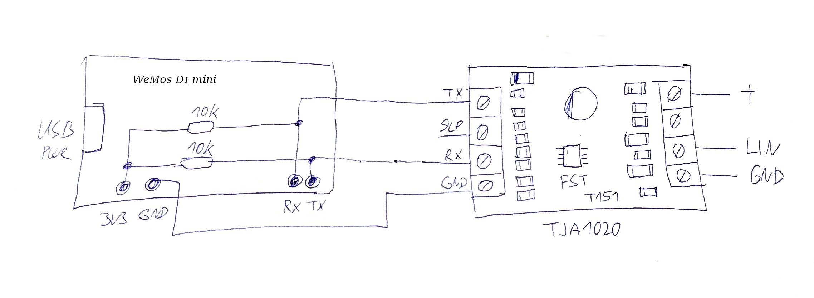

# ESP Atrea #
Replacement of a CP07 controller with the ESP8266 module for controlling the Atrea RK2 heat recovery unit and similar using Home Assistant. The module can either monitor or directly replace the CP07 controller via ESP8266, LIN bus interface and a Home Assistant. The module allows control of ventilation, heating and cooling.


# Hardware
The CP07 controller communicates with the ATREA RK2 heat recovery unit via the LIN bus. It communicates at 300 Bauds and each packet has 10 bytes. The CP07 controller sends a query to the Atrea unit (the type is in bytes 2 and 3) and receives a response from Atrea.

For the connection use a LIN bus interface [TTL UART to LIN Can Bus Converter](https://www.aliexpress.com/item/4001054538389.html) or maybe [UART to LIN Bus Module](https://www.aliexpress.com/item/1005002376896294.html) and an ESP8266 module WeMos D1 mini, which is connected in parallel to the CP07 driver line. If the program detects the presence of the CP07 driver in the ESP8266 after startup, it will only listen to the ATREA system status. If the driver is not present, the module will take over its function. The CP07 driver is still required to configure the unit, but can be disconnect after setup ATREA.



# Logs CP07 (fw 54.07) <-> Atrea (PIC fw 53.59 for Heating pump)
## operating mode equal pressure ventilation (RV)
#### not heating season
    off ventilation
      [CP-07]: F5 00 01 01 10 02 01 00 00 7C
      [ATREA]: F5 00 01 00 00 00 3D 48 FB EC
    medium ventilation
      [CP-07]: F5 00 01 02 10 02 01 00 00 25
      [ATREA]: F5 00 01 10 01 00 3D 48 FB 7A
    max ventilation
      [CP-07]: F5 00 01 04 10 02 01 00 00 97
      [ATREA]: F5 00 01 10 02 00 3D 48 FB 34
    medium / max shock ventilation
      [ATREA]: F5 00 01 10 12 00 3B 45 FB 10
      [ATREA]: F5 00 01 10 32 00 3B 48 FB 61
#### heating season, not heating
    off ventilation
      [CP-07]: F5 00 01 01 10 02 01 02 00 ED 
      [ATREA]: F5 00 01 00 00 00 3D 47 FB F4
    medium ventilation
      [CP-07]: F5 00 01 02 10 02 01 02 00 B4 
      [ATREA]: F5 00 01 10 01 00 3D 48 FB 7A
    max ventilation
      [CP-07]: F5 00 01 04 10 02 01 02 00 06 
      [ATREA]: F5 00 01 10 02 00 3D 47 FB 2C
    medium / max shock ventilation
      [ATREA]: F5 00 01 10 32 00 3C 48 FB 1B
#### heating season, heating
    off ventilation (nonsense)
      [CP-07]: F5 00 01 01 10 02 01 03 00 29  
      [ATREA]: F5 00 01 00 00 00 3D 49 FB 28
    medium ventilation
      [CP-07]: F5 00 01 02 10 02 01 03 00 70
      [ATREA]: F5 00 01 10 09 00 3D 49 FB 80    // electric boiler heating
      [ATREA]: F5 00 01 10 29 00 3C 59 FB 3F    // electric boiler heating
    max ventilation
      [CP-07]: F5 00 01 04 10 02 01 03 00 C2
      [ATREA]: F5 00 01 10 0A 00 3D 54 FB xx    // electric boiler heating
      [ATREA]: F5 00 01 10 2A 00 3C 5A FB 24    // electric boiler heating
    medium / max shock ventilation
      [ATREA]: F5 00 01 10 1A 00 3D 58 FB 9A    // electric boiler heating
      [ATREA]: F5 00 01 10 3A 00 3D 46 FB 52    // electric boiler heating

## operating mode circulation ventilation (CV)
#### not heating season
    off ventilation
      [CP-07]: F5 00 01 01 08 02 01 00 00 3E
      [ATREA]: F5 00 01 00 00 00 3B 47 FB xx
      [ATREA]: F5 00 01 00 20 00 3B 47 FB DD
    medium ventilation
      [CP-07]: F5 00 01 02 08 02 01 00 00 67
      [ATREA]: F5 00 01 08 01 00 3B 49 FB 95
    max ventilation
      [CP-07]: F5 00 01 04 08 02 01 00 00 D5
      [ATREA]: F5 00 01 08 02 00 3B 49 FB DB
    medium / max shock ventilation WC
      [ATREA]: F5 00 01 08 31 00 3B 47 FB CD
      [ATREA]: F5 00 01 08 32 00 3B 47 FB 83
    medium / max shock ventilation kitchen
      [ATREA]: F5 00 01 10 32 00 3B 47 FB 79    // RV mode
#### heating season, not heating 
    off ventilation
      [CP-07]: F5 00 01 01 08 02 01 02 00 AF 
      [ATREA]: F5 00 01 00 00 00 3D 48 FB EC
    medium ventilation
      [CP-07]: F5 00 01 02 08 02 01 02 00 F6 
      [ATREA]: F5 00 01 08 01 00 3D 48 FB 80
    max ventilation
      [CP-07]: F5 00 01 04 08 02 01 02 00 44 
      [ATREA]: F5 00 01 08 02 00 3D 48 FB CE
    medium / max shock ventilation WC
      [ATREA]: F5 00 01 08 11 00 3D 49 FB 38
      [ATREA]: F5 00 01 08 12 00 3D 49 FB 76
    medium / max shock ventilation kitchen
      [ATREA]: F5 00 01 10 12 00 3D 49 FB 8C    // RV mode
#### heating season, heating 
    off ventilation
      [CP-07]: F5 00 01 01 08 02 01 03 00 6B 
      [ATREA]: F5 00 01 00 00 00 3D 58 FB 00
    medium ventilation
      [CP-07]: F5 00 01 02 08 02 01 03 00 32
      [ATREA]: F5 00 01 08 09 00 3B 47 FB 77
    max ventilation
      [CP-07]: F5 00 01 04 08 02 01 03 00 80 
      [ATREA]: F5 00 01 08 0A 00 3D 5E FB B6
    medium / max shock ventilation WC
      [ATREA]: F5 00 01 08 19 00 3C 56 FB 59
      [ATREA]: F5 00 01 08 39 00 3C 54 FB 30
      [ATREA]: F5 00 01 08 1A 00 3C 58 FB CB
      [ATREA]: F5 00 01 08 3A 00 3C 56 FB EF
    medium / max shock ventilation kitchen
      [ATREA]: F5 00 01 10 1A 00 3D 49 FB B2    // RV mode, electric boiler heating
      [ATREA]: F5 00 01 10 3A 00 3C 49 FB E1    // RV mode, electric boiler heating

## operating mode dependent circulation (CZ)
#### not heating season
    off ventilation
      [CP-07]: F5 00 01 01 04 02 02 00 00 FB
      [ATREA]: F5 00 01 00 20 00 3B 47 FB DD
    medium ventilation
      [CP-07]: F5 00 01 02 04 02 02 00 00 A2
      [ATREA]: F5 00 01 04 20 00 3C 4B FB 36    // standby
      [ATREA]: F5 00 01 08 21 00 3E 4A FB 0D    // ventilation (CV mode)
    max ventilation
      [CP-07]: F5 00 01 04 04 02 02 00 00 10
      [ATREA]: F5 00 01 04 20 00 3B 4A FB 88    // standby
      [ATREA]: F5 00 01 08 22 00 3E 4A FB xx    // ventilation (CV mode)
    medium / max shock ventilation WC
      [ATREA]: F5 00 01 04 31 00 3B 49 FB 6C
      [ATREA]: F5 00 01 04 32 00 3B 49 FB 22
    medium / max shock ventilation kitchen
      [ATREA]: F5 00 01 10 32 00 3B 49 FB A5    // RV mode
#### heating season, not heating
    off ventilation
      [CP-07]: F5 00 01 01 04 02 02 02 00 6A 
      [ATREA]: F5 00 01 00 20 00 3D 4C FB 2F
    medium ventilation
      [CP-07]: F5 00 01 02 04 02 02 02 00 33 
      [ATREA]: F5 00 01 04 20 00 3C 4B FB 36    // standby
      [ATREA]: F5 00 01 08 21 00 3E 4A FB 0D    // ventilation (CV mode)
    max ventilation
      [CP-07]: F5 00 01 04 04 02 02 02 00 81 
      [ATREA]: F5 00 01 04 20 00 3C 4B FB 36    // standby
      [ATREA]: F5 00 01 08 22 00 3E 4A FB xx    // ventilation (CV mode)
    medium / max shock ventilation WC
      [ATREA]: F5 00 01 04 31 00 3C 4A FB 43
      [ATREA]: F5 00 01 04 32 00 3D 57 FB C3
    medium / max shock ventilation kitchen
      [ATREA]: F5 00 01 10 32 00 3C 49 FB DF    // RV mode
#### heating season, heating
    off ventilation
      [CP-07]: F5 00 01 01 04 02 02 03 00 AE 
      [ATREA]: F5 00 01 00 20 00 3D 58 FB F8
    medium ventilation
      [CP-07]: F5 00 01 02 04 02 02 03 00 F7 
      [ATREA]: F5 00 01 04 29 00 3D 57 FB CF    // standby
      [ATREA]:                                  // ventilation with heating
    max ventilation
      [CP-07]: F5 00 01 04 04 02 02 03 00 45 
      [ATREA]: F5 00 01 04 2A 00 3D 55 FB 10    // standby
      [ATREA]:                                  // ventilation with heating
    medium / max shock ventilation WC
      [ATREA]: F5 00 01 04 39 00 3C 53 FB 23
      [ATREA]: F5 00 01 04 3A 00 3D 55 FB 6C
    max shock ventilation kitchen      
      [ATREA]: F5 00 01 10 3A 00 3C 4E FB 8F    // RV mode, electric boiler heating

## operating mode circulation (C)
#### not heating season
    off ventilation
      [CP-07]: F5 00 01 01 04 02 01 00 00 1F
      [ATREA]: F5 00 01 00 00 00 3B 46 FB E1
    medium ventilation
      [CP-07]: F5 00 01 02 04 02 01 00 00 46
      [ATREA]: F5 00 01 04 01 00 3B 4A FB BD
    max ventilation
      [CP-07]: F5 00 01 04 04 02 01 00 00 F4
      [ATREA]: F5 00 01 04 02 00 3B 49 FB A6
    medium / max shock ventilation WC
      [ATREA]: F5 00 01 04 11 00 3B 48 FB 50
      [ATREA]: F5 00 01 04 12 00 3B 48 FB 1E
    medium / max shock ventilation kitchen
      [ATREA]: F5 00 01 10 12 00 3B 47 FB 81    // RV mode
#### heating season, not heating      
    off ventilation
      [CP-07]: F5 00 01 01 04 02 01 02 00 8E 
      [ATREA]: F5 00 01 00 00 00 3C 4C FB 7C
    medium ventilation
      [CP-07]: F5 00 01 02 04 02 01 02 00 D7 
      [ATREA]: F5 00 01 04 01 00 3C 4C FB 6D
    max ventilation
      [CP-07]: F5 00 01 04 04 02 01 02 00 65 
      [ATREA]: F5 00 01 04 02 00 3C 4B FB 4D
    medium / max shock ventilation Wc
      [ATREA]: F5 00 01 04 11 00 3D 4A FB 10
      [ATREA]: F5 00 01 04 12 00 3D 49 FB 0B
    medium / max shock ventilation kitchen
      [ATREA]: F5 00 01 10 12 00 3D 49 FB 8C    // RV mode
#### heating season, heating
    off ventilation
      [CP-07]: F5 00 01 01 04 02 01 03 00 4A 
      [ATREA]: F5 00 01 00 00 00 3C 5B FB FE
    medium ventilation
      [CP-07]: F5 00 01 02 04 02 01 03 00 13 
      [ATREA]: F5 00 01 04 09 00 3C 59 FB 40
    max ventilation
      [CP-07]: F5 00 01 04 04 02 01 03 00 A1 
      [ATREA]: F5 00 01 04 0A 00 3C 58 FB CA
    medium / max shock ventilation WC
      [ATREA]: F5 00 01 04 19 00 3D 4A FB 2E
      [ATREA]: F5 00 01 04 1A 00 3C 54 FB FB
    medium / max shock ventilation kitchen
      [ATREA]: F5 00 01 10 1A 00 3C 53 FB 12    // RV mode, electric boiler heating

## operating mode pressure ventilation (PV)
    off ventilation
      [CP-07]: F5 00 01 01 01 02 01 00 00 CD
      [ATREA]: F5 00 01 00 00 00 3B 46 FB E1
    medium ventilation
      [CP-07]: F5 00 01 02 01 02 01 00 00 94
      [ATREA]: F5 00 01 01 01 00 3B 49 FB 03
    max ventilation
      [CP-07]: F5 00 01 04 01 02 01 00 00 26
      [ATREA]: F5 00 01 01 02 00 3B 49 FB 4D
    medium / max shock ventilation
      [ATREA]: F5 00 01 01 11 00 3B 49 FB 7F
      [ATREA]: F5 00 01 01 12 00 3B 47 FB ED
      
## operating mode cooling
#### not cooling
    cooling off
      [CP-07]: F5 00 01 01 01 02 02 00 00 xx
      [ATREA]: F5 00 01 00 20 00 3B 44 FB 88
    medium cooling
      [CP-07]: F5 00 01 02 01 02 02 00 00 xx
      [ATREA]: F5 00 01 05 20 00 3D 42 FB xx
    max cooling
      [CP-07]: F5 00 01 04 01 02 02 00 00 xx
      [CP-07]: F5 00 01 04 01 01 02 00 00 xx
      [ATREA]: F5 00 01 05 20 00 3D 49 FB xx
    medium / max shock ventilation WC
      [ATREA]: F5 00 01 01 31 00 3B 49 FB 87
      [ATREA]: F5 00 01 01 32 00 3B 49 FB C9
    medium / max shock ventilation kitchen
      [ATREA]: F5 00 01 01 31 00 3B 44 FB 0E
#### cooling
    cooling off
      [CP-07]: F5 00 01 01 01 02 02 01 00 ED
      [ATREA]: F5 00 01 00 20 00 3B 44 FB 88
    medium cooling
      [CP-07]: F5 00 01 02 01 02 02 01 00 B4
      [ATREA]: F5 00 01 05 21 00 3D 42 FB D5
    max cooling
      [CP-07]: F5 00 01 04 01 02 02 01 00 06
      [ATREA]: F5 00 01 05 22 00 3D 49 FB B8
    off / medium / max shock ventilation WC
      [ATREA]: F5 00 01 10 32 00 3C 4A FB 8A
      [ATREA]: F5 00 01 01 31 00 3B 49 FB 87
      [ATREA]: F5 00 01 01 32 00 3B 49 FB C9
    medium / max shock ventilation kitchen
      [ATREA]: F5 00 01 01 31 00 3B 44 FB 0E

## servis
    main menu
      [CP-07]: F5 00 01 02 10 02 01 02 00 B4
      [ATREA]: F5 00 01 10 32 00 3D 43 FB 93
      [CP-07]: F5 01 03 02 10 02 01 02 00 8D
      [ATREA]: F5 01 03 FF 43 43 3D 00 A9 C6
      [CP-07]: F5 02 03 02 10 02 01 02 00 48
      [ATREA]: F5 02 03 FF 33 82 EC FF FB 8C
      [CP-07]: F5 00 03 02 10 02 01 02 00 CE
      [ATREA]: F5 00 03 61 0A 00 00 00 81 7A
    outputs control
      [CP-07]: F5 43 01 00 00 00 00 00 00 17
      [ATREA]: F5 43 01 03 02 00 00 00 00 CD
      [CP-07]: F5 41 01 00 00 00 00 00 00 91
      [ATREA]: F5 41 01 12 11 0B 00 00 00 81
      [CP-07]: F5 42 01 00 00 00 00 00 00 54
      [ATREA]: F5 42 01 FF 33 82 EC FF 3B 75
      
## startup sequence
    [CP-07]: F5 00 01 01 10 02 01 00 00 7C
    [CP-07]: F5 00 01 01 10 02 01 00 00 7C
    [ATREA]: F5 00 01 00 00 00 00 00 FB CF
    [CP-07]: F5 00 01 01 10 02 01 00 00 7C
    [ATREA]: F5 00 01 1F 0F 00 00 00 FB DF
    [CP-07]: F5 00 01 01 10 02 01 00 00 7C
    [ATREA]: F5 00 01 1F 0F 00 00 00 FB DF
    [CP-07]: F5 00 01 01 10 02 01 00 00 7C
    [ATREA]: F5 00 01 1F 0F 00 00 00 FB DF
    [CP-07]: F5 00 01 01 10 02 01 00 00 7C
    [ATREA]: F5 00 01 1F 0F 00 00 00 FB DF
    [CP-07]: F5 00 01 01 10 02 01 00 00 7C
    [ATREA]: F5 00 01 1F 0F 00 00 00 FB DF
    [CP-07]: F5 00 01 01 10 02 01 00 00 7C
    [ATREA]: F5 00 01 1F 0F 00 00 00 FB DF
    [CP-07]: F5 00 01 01 10 02 01 00 00 7C
    [ATREA]: F5 00 01 1F 0F 00 00 00 FB DF
    [CP-07]: F5 00 01 01 10 02 01 00 00 7C
    [ATREA]: F5 00 01 1F 0F 00 3E 4B FB 4D
    [CP-07]: F5 52 01 01 10 02 01 00 00 E7
    [ATREA]: F5 52 01 32 4B 0F 35 00 00 6B
    [CP-07]: F5 53 01 01 10 02 01 00 00 A4
    [ATREA]: F5 53 01 37 2D 19 30 00 00 4A
    [CP-07]: F5 54 01 01 10 02 01 00 00 74
    [ATREA]: F5 54 01 32 0A 01 FF 00 00 F0
    [CP-07]: F5 52 01 01 10 02 01 00 00 E7
    [ATREA]: F5 52 01 32 4B 0F 35 00 00 6B
    [CP-07]: F5 53 01 01 10 02 01 00 00 A4
    [ATREA]: F5 53 01 37 2D 19 30 00 00 4A
    [CP-07]: F5 54 01 01 10 02 01 00 00 74
    [ATREA]: F5 54 01 32 0A 01 FF 00 00 F0
    [CP-07]: F5 54 01 01 10 02 01 00 00 74
    [ATREA]: F5 54 01 32 0A 01 FF 00 00 F0


# Decode packets
### The requests packet from the CP07 controller to the Atrea unit:
- 0xF5 [id1 0,1,2] [id2 1,3] [intensity 1,2,4] [mode 1,2,4,8,16] [1,2] [md2 1,2] [temp 0,1,2,3] 0x00 [crc]
    - id1 and id2: 0 1, 0 3, 1 3, 2 3
    - intensity is 1=off, 2=medium or 4=max
    - modes:
        - pressure ventilation (PV): mode = 1, md2 = 1, temp = 0
        - circulation (C): mode = 4, md2 = 1, temp = 0, 2, 3
        - dependent circulation (CZ): mode = 4, md2 = 2, temp = 0, 2, 3
        - circulation ventilation (CV): mode = 8, md2 = 1, temp = 0, 2, 3
        - equal pressure ventilation (RV): mode = 16, md2 = 1, temp = 0, 2, 3
        - cooling: mode = 1, md2 = 2, temp = 0, 1
    - temp: bit 0x01 = heating / cooling, bit 0x02 = heating season (for new fw CP07?)

- 0xF5 [id1 0x41,0x42,0x43] [id2 0x01] [circulation] [DA2] [MC] [MV] [bits] 0x00 [crc]
    - simul. voltage circulation flap: 0=0V..10V=0xFF
    - simul. voltage node DA2: 0=0V..10V=0xFF
    - engine MC: 0,1,2,3
    - engine MV: 0,1,2
    - bits: bypass 1, ZR 2, pump 4, boiler 8, output OC1 16, output EXT 32

### The responds packet with the same id1 and id2 from the Atrea unit to the CP07 controller:
- 0xF5 [id1 0x00] [id2 0x01] [mode2 0,1,2,4,5,8,16] [flags: intensity [0,1,2], errorB 0x04, heating 0x08, shock vent. 0x10, ? 0x20] [errors] [TE] [TA] x [crc]
    - modes:
        - nothing: mode2 = 0, flags = 0 or 0x20
        - pressure ventilation: mode2 = 1, flags = 1 or 2
        - circulation: mode2 = 4, flag = 1 or 2
        - dependent circulation standby: mode2 = 4, flags = 0x20
        - dependent circulation ventilation: mode2 = 8, flags = 0x21 or 0x22
        - circulation ventilation: mode2 = 8, flag = 1 or 2
        - equal pressure ventilation: mode2 = 16, flag = 0x21 or 0x22 (electric boiler heating)
        - cooling: mode2 = 5, flags = 0x21 or 0x22
        - heating: mode2 = 4 (circulation dep. and circulation), 8 (circulation vent.), 16 (equal press. vent.), flags = 1 or 2 + 0x08
    - intensity: 0=off, 1=medium or 2=max
    - shock ventilation flag 0x10 (0x31 or 0x32 with intensity 1 or 2)
    - ? 0x20: ?
    - errorB: 0x04 = filter clogged
    - errors: 1=TE error, 2=TI2 error, 4=recuperator freezing, 8=TA error, 16=1st.freezing protection, 32=2nd.freezing protection, 64=active STOP, 128=communication error
    - outdoor temperature = TE-50
    - radiator temperature = TA-50

- 0xF5 [id1 0x00] [id2 0x03] [0x60 + power inputs D1-D4 1,2,4,8] [mode] [i1 0x00] [i2 0x00] [i3 0x00] [bits] [crc]
    - power inputs: D1-D3 WC and bathroom 1,2,4, D4 kitchen 8, D11 ?
    - mode: 0=off, 2=PV medium or C medium, 3=PV max or C max, 5=RV medium, 10=RV max or shock ventilation, 6=CV medium, 7=CV max
    - i1-i3: I thing voltage in1-in3 0=0V..10V=0xFF
    - bits: 1=ground cooler/input flap SR, 2=bypass SB
  
- 0xF5 [id1 0x02] [id2 0x03] 0xFF 0x33 0x82 0xEC 0xFF 0xCB [crc]
  
- 0xF5 [id1 0x01] [id2 0x03] [circulation] [TA] [TI2] [TE] 0x00 0x99 [crc]
    - circulation flap 0-255 = 0-10V (adding fresh air 0-0%, 255-100%)
    - radiator temperature = TA-50
    - behind recuperator temperature = TI2-50
    - outdoor temperature = TE-50

- 0xF5 [id1 0x41] [id2 0x01] [TA] [TI2] [TE] 0x00 0x00 0x00 [crc]
    - radiator temperature = TA
    - behind recuperator temperature = TI2
    - outdoor temperature = TE
      
- 0xF5 [id1 0x42] [id2 0x01] 0xFF 0x33 0x82 0xEC 0xFF 0x0B [crc]
  
- 0xF5 [id1 0x43] [id2 0x01] 0x03 [D1..4] 0x00 0x00 0x00 0x00 [crc]
    - D1..4: D1-D3 WC and bathroom 2,4,8, D4 kitchen 16

# Instalation
Programming of the module uses the ESPHome environment. The code is written in C and in YAML (espatrea.h espatrea.yaml). The files are moved to configuration/esphome. The wifi password is in secrets.yaml . In espatrea.yaml, edit the API Key and OTA passwords.


# Examples of automations
Solar gain circulation
```
alias: VZT - cirkulace solárních ziskù
description: ""
trigger:
  - platform: state
    entity_id:
      - sun.sun
    attribute: azimuth
  - platform: numeric_state
    entity_id: sensor.pv_power
    for:
      hours: 0
      minutes: 10
      seconds: 0
    above: 2500
    enabled: false
condition:
  - condition: time
    after: "09:30:00"
    before: "17:00:00"
action:
  - if:
      - condition: numeric_state
        entity_id: sun.sun
        attribute: azimuth
        above: 140
        below: 220
      - condition: numeric_state
        entity_id: sensor.pv_power
        above: 2500
    then:
      - device_id: 904cd0b7d9147d7b3b4ad392bb80d9a8
        domain: select
        entity_id: select.esp_rezim_vzt
        type: select_option
        option: Cirkulace
    else:
      - device_id: 904cd0b7d9147d7b3b4ad392bb80d9a8
        domain: select
        entity_id: select.esp_rezim_vzt
        type: select_option
        option: Cirkulace závislá
mode: single
```

Control heating and cooling
```
alias: VZT - řízeni topení a chlazení
description: >-
  VZT nastavování teploty topení, blokování topení podle ceny, chlazení pøi
  nadbytku FVE
trigger:
  - platform: state
    entity_id:
      - sensor.final_price_kwh
    for:
      hours: 0
      minutes: 0
      seconds: 5
  - platform: state
    entity_id:
      - binary_sensor.atrea_narazove_vetrani
  - platform: state
    entity_id:
      - sensor.pv_power
    enabled: false
  - platform: time_pattern
    minutes: /20
action:
  - alias: topení
    if:
      - condition: state
        entity_id: climate.home_thermostat
        state: heat
    then:
      - if:
          - condition: or
            conditions:
              - condition: state
                entity_id: binary_sensor.count_offpeak_heat_cheapest_hours
                state: "on"
              - condition: state
                entity_id: binary_sensor.count_peak_heat_cheapest_hours
                state: "on"
        then:
          - data:
              value: 1
            target:
              entity_id: input_number.upravena_temperature
            alias: nastaví offset termostatu na 0,5 kvuli levne energii
            action: input_number.set_value
        else:
          - data:
              value: 0
            target:
              entity_id: input_number.upravena_temperature
            alias: vypnuti offsetu termostatu
            action: input_number.set_value
      - if:
          - condition: state
            entity_id: binary_sensor.count_expensive_hours
            state: "on"
        then:
          - device_id: 904cd0b7d9147d7b3b4ad392bb80d9a8
            domain: select
            entity_id: select.esp_intenzita
            type: select_option
            option: Vypnuto
        else:
          - device_id: 904cd0b7d9147d7b3b4ad392bb80d9a8
            domain: select
            entity_id: select.esp_intenzita
            type: select_option
            option: Střední
    else:
      - alias: kontrola nadbytku energie pro chlazeni
        if:
          - condition: and
            conditions:
              - condition: or
                conditions:
                  - condition: numeric_state
                    entity_id: sensor.pv_power
                    above: 2800
                  - condition: numeric_state
                    entity_id: sensor.export_s_tc
                    above: 900
              - condition: numeric_state
                entity_id: sensor.battery_state_of_charge
                above: 50
              - condition: numeric_state
                entity_id: sensor.solcast_pv_forecast_forecast_remaining_today
                below: sensor.battery_state_of_charge
                value_template: >-
                  {{ max(130 - 100 *
                  states('sensor.solcast_pv_forecast_forecast_remaining_today')
                  | float(default=50.0) / 14.4, 0) }}
                alias: bude vìtší výroba energie FVE k dobití baterie do 100%
        then:
          - data:
              hvac_mode: cool
            target:
              entity_id: climate.home_thermostat
            action: climate.set_hvac_mode
          - device_id: 904cd0b7d9147d7b3b4ad392bb80d9a8
            domain: select
            entity_id: select.esp_intenzita
            type: select_option
            option: Maximální
            enabled: false
        else:
          - data:
              hvac_mode: "off"
            target:
              entity_id: climate.home_thermostat
            action: climate.set_hvac_mode
          - device_id: 904cd0b7d9147d7b3b4ad392bb80d9a8
            domain: select
            entity_id: select.esp_intenzita
            type: select_option
            option: Støední
            enabled: false
mode: single
```

Control heatin and cooling bypass
```
alias: VZT - øízení klapky špajzu pro chlazení / topení
description: chlazení a topení ve špajzu
trigger:
  - platform: state
    entity_id:
      - binary_sensor.atrea_chlazeni
    for:
      hours: 0
      minutes: 1
      seconds: 0
  - platform: state
    entity_id:
      - binary_sensor.atrea_topeni
    for:
      hours: 0
      minutes: 1
      seconds: 0
  - platform: time_pattern
    minutes: /10
condition: []
action:
  - if:
      - condition: or
        conditions:
          - condition: state
            entity_id: binary_sensor.atrea_chlazeni
            state: "on"
          - condition: and
            conditions:
              - condition: state
                entity_id: binary_sensor.atrea_topeni
                state: "on"
              - condition: numeric_state
                entity_id: sensor.th_spiz_temperature
                below: 10
    then:
      - type: turn_on
        device_id: 7b6b2b2705a9a6d467216a1d3fba84c2
        entity_id: light.klapka_spajz_vypinac
        domain: light
      - type: turn_on
        device_id: 7b6b2b2705a9a6d467216a1d3fba84c2
        entity_id: light.klapka_spajz_vypinac_2
        domain: light
    else:
      - type: turn_off
        device_id: 7b6b2b2705a9a6d467216a1d3fba84c2
        entity_id: light.klapka_spajz_vypinac
        domain: light
      - type: turn_off
        device_id: 7b6b2b2705a9a6d467216a1d3fba84c2
        entity_id: light.klapka_spajz_vypinac_2
        domain: light
mode: single
```
